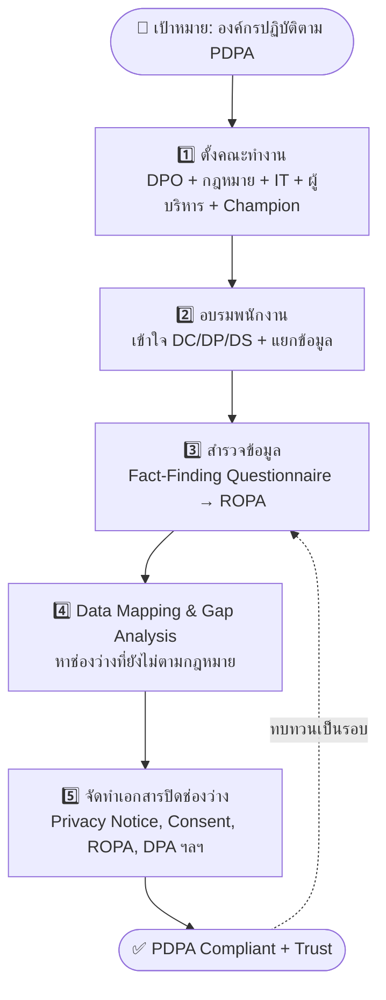

# 🔄 Flowchart: 5 ขั้นตอนวางระบบงานให้เป็นไปตาม PDPA
### (PDPA Implementation & Compliance Control) — จาก Workshop คาบ 3
> ใช้ทบทวนเร็วก่อนสอบ — จำลำดับ "คน → ความรู้ → สำรวจ → วิเคราะห์ → ลงมือทำเอกสาร"

---

## 📊 แผนภาพ (ASCII — เปิดที่ไหนก็เห็น)

```
        ┌──────────────────────────────────────────────┐
        │   เป้าหมาย: องค์กรปฏิบัติตาม PDPA (Compliant)   │
        └──────────────────────────────────────────────┘
                              │
                              ▼
   ┌───────────────────────────────────────────────────────┐
   │ 1️⃣  ตั้งคณะทำงาน                                        │
   │     DPO + ฝ่ายกฎหมาย + IT + ผู้บริหาร + Champion        │
   │     (Champion = ตัวแทนแต่ละฝ่ายที่ใช้ข้อมูลจริง)         │
   └───────────────────────────────────────────────────────┘
                              │  มีทีมแกนแล้ว
                              ▼
   ┌───────────────────────────────────────────────────────┐
   │ 2️⃣  อบรมพนักงาน                                         │
   │     เข้าใจ DC / DP / DS + แยกข้อมูลส่วนบุคคล vs ทั่วไป   │
   └───────────────────────────────────────────────────────┘
                              │  ทีมเข้าใจกฎหมาย
                              ▼
   ┌───────────────────────────────────────────────────────┐
   │ 3️⃣  สำรวจข้อมูล (Fact-Finding Questionnaire)            │
   │     Champion แต่ละฝ่ายกรอกกิจกรรมที่ใช้ข้อมูล            │
   │     ➜ ได้ ROPA ของแต่ละฝ่าย → รวมเป็น ROPA บริษัท       │
   └───────────────────────────────────────────────────────┘
                              │  รู้ว่ามีข้อมูลอะไร/ไหลไปไหน
                              ▼
   ┌───────────────────────────────────────────────────────┐
   │ 4️⃣  Data Mapping & Gap Analysis                        │
   │     ทำแผนผังการไหลข้อมูล + หา "ช่องว่าง" ที่ยังไม่ตามกม. │
   │     ➜ ได้ "List of Key Issues & Recommendations"        │
   └───────────────────────────────────────────────────────┘
                              │  รู้ว่าต้องแก้ตรงไหน
                              ▼
   ┌───────────────────────────────────────────────────────┐
   │ 5️⃣  จัดทำเอกสาร/เครื่องมือปิดช่องว่าง                    │
   │   • Privacy Notice / Privacy Policy   • Consent Form    │
   │   • Retention Policy                  • DSAR Form       │
   │   • ROPA                              • แผนรับมือละเมิด  │
   │   • DPA / Data Sharing Agreement      • มาตรการ Security │
   └───────────────────────────────────────────────────────┘
                              │
                              ▼
        ┌──────────────────────────────────────────────┐
        │   ✅ องค์กร PDPA Compliant + สร้าง Trust         │
        │   🔁 ทบทวน/ปรับปรุงเป็นรอบ (ต่อเนื่อง)           │
        └──────────────────────────────────────────────┘
```

---

## 🧜 แบบ Mermaid (ถ้าเปิดในโปรแกรมที่เรนเดอร์ได้ เช่น VS Code, Obsidian, GitHub)



---

## 🧠 ตัวช่วยจำ (Mnemonic)
> **"ตั้ง–อบ–สำ–วิ–ทำ"**
> **ตั้ง**คณะทำงาน → **อบ**รม → **สำ**รวจ → **วิ**เคราะห์ช่องว่าง → **ทำ**เอกสาร

| ขั้น | คำถามที่ขั้นนั้นตอบ | ผลลัพธ์ |
|:---:|---|---|
| 1 | "ใครรับผิดชอบ?" | คณะทำงาน + Champion |
| 2 | "ทุกคนเข้าใจตรงกันไหม?" | พนักงานรู้กฎหมาย |
| 3 | "เรามีข้อมูลอะไรบ้าง?" | ROPA |
| 4 | "ตรงไหนยังไม่ถูกกฎหมาย?" | Gap Analysis |
| 5 | "จะปิดช่องว่างยังไง?" | ชุดเอกสาร/มาตรการ |

> 💡 ออกสอบบ่อย: **ROPA เกิดที่ขั้น 3** · **Gap Analysis ที่ขั้น 4** · **เอกสาร (Privacy Notice/Consent/DPA) ที่ขั้น 5**
